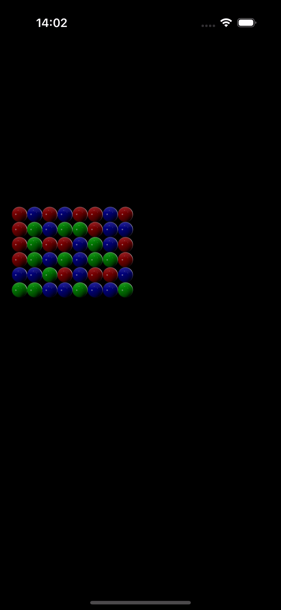
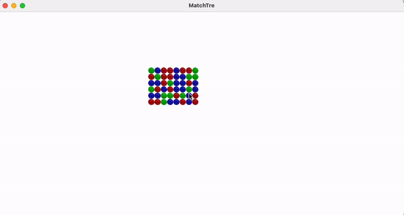

# Match Three Game in VisionOS, iOS and MacOS 

## Declaimer

Author: Cecilia Humlelu, copy right reserved

## Brief Summary
The Match Tre game app is one of the most class games, when there is a match on the horizontal line, the match is removed. 
The app is coded to support 3 platforms: MacOS, iOS and VisionOS. 

## Challenges 

The challenges of implementing this app is 
- The logic of finding matches
- The time and code order of removing matches, tile falling and filling the empty tiles
- Understanding the origin, coordination and position system of the different platforms
- To make sure if runs on all three different platforms and different tech stacks

## Game Mechanics/Rules

* The game consists of m x n tiles (configurable in the code).
* If three or more of the same tile type are in a horizontal row, the game removes them.
* A tile falls down if there is no tile below it (unless it’s on the bottom row).
* The user can click on a tile. The game then removes the tile.
* When the game starts, all the positions should be filled with tiles and nothing should fall down.
* When a tile falls down, it should animate.

## The Reflection 
It is definately fun and creative to make apps in iOS and to be able to support the latest technology. The visionOS is a whole new world. I am still curious about where this technology can serve the best for our human beings. 

## Demo
### VisionOS 

### iOS

### macOS

